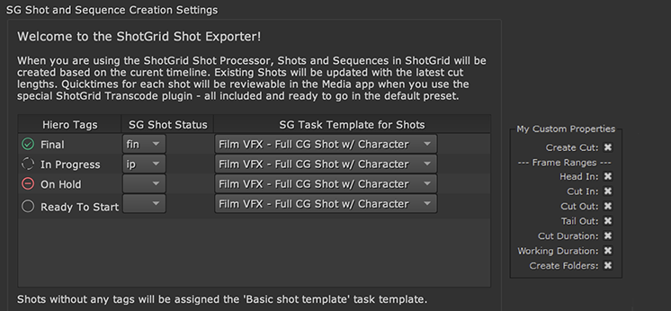

Shotgun Hiero Export API reference, |release|
#############################################

Overview
********

The ``tk-hiero-export`` app adds custom Shotgun export processors to the Hiero/Nuke Studio export framework.

By way of custom export processors, the user can create and update entities in the current Project in Shotgun.

During the export process a number things can happen:

- Status of associated Shot entities can be updated
- Nuke scripts can be written into the project's filesystem structure for each Shot that's processed
- Sequence and Shot entity data can be updated in Shotgun
- Cuts can be update to include new CutItems built from the exported sequences

Documentation from The Foundry concerning the Hiero Python API can be found `here. <https://learn.foundry.com/hiero/developers/11.0/HieroPythonDevGuide/api/index.html>`_

Hooks
*****

Hooks provided by the Hiero Export app allow for customization of various aspects of the export process and its UI.

.. py:currentmodule:: base_hooks

Updating Shot entities
----------------------

.. autoclass:: HieroUpdateShot
    :members:

Updating and Creating Cut and CutItem entities
----------------------------------------------

.. autoclass:: HieroUpdateCuts
    :members:

Getting Shot entities for Hiero TrackItems
------------------------------------------

.. autoclass:: HieroGetShot
    :members:

Customizing Quicktime export settings
-------------------------------------

.. autoclass:: HieroGetQuicktimeSettings
    :members:

Customizing PublishedFile data
------------------------------

.. autoclass:: HieroGetExtraPublishData
    :members:

Executing logic after Version entity creation
---------------------------------------------

.. autoclass:: HieroPostVersionCreation
    :members:

Executing logic prior to export
-------------------------------

.. autoclass:: HieroPreExport
    :members:

Resolving strings into Shotgun-queried values
---------------------------------------------

.. autoclass:: HieroResolveCustomStrings
    :members:

Resolving Shotgun Toolkit templates into export string representations
----------------------------------------------------------------------

.. autoclass:: HieroTranslateTemplate
    :members:

Customizing Version entity data
-------------------------------

.. autoclass:: HieroUpdateVersionData
    :members:

Uploading Thumbnails to Shotgun
-------------------------------

.. autoclass:: HieroUploadThumbnail
    :members:

Creating custom UI elements and properties
------------------------------------------

Each processor/exporter utilized by the Hiero export app can have its properties and UI customized.

Creating custom UI elements for the Hiero export app involves three steps:

- Creating a widget
- Defining custom properties to add to the associated preset
- Setting the widget up to display controls for the custom properties

These steps are implemented for processors/exporters in each of their associated hook methods:

- create_*_widget()
- get_*_ui_properties()
- set_*_ui_properties()

Example Custom UI:

.. autoclass:: HieroCustomizeExportUI
    :members:

